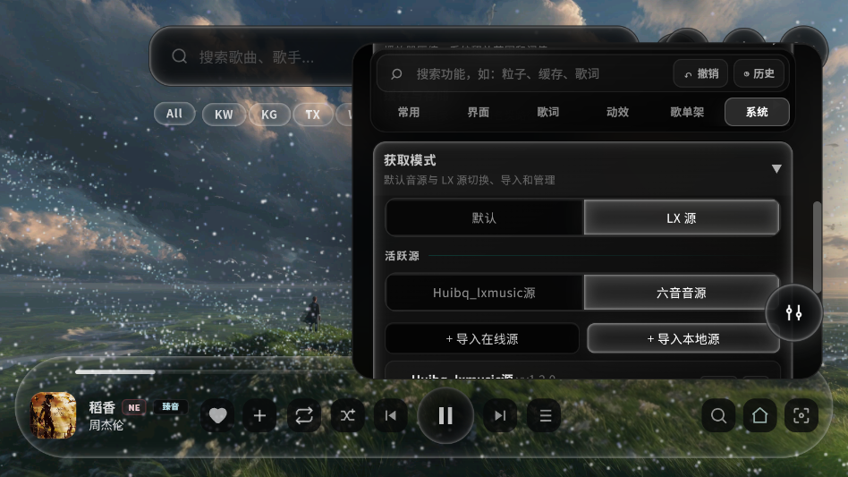

# Mineradio

Windows Electron 桌面 + Android 沉浸式音乐播放器。整合天气电台、多源搜索播放、歌词舞台、粒子视觉、3D 歌单架和 LX Music 音源系统。

> **声明**：本项目是基于 [XxHuberrr/Mineradio](https://github.com/XxHuberrr/Mineradio.git) 的二次开发版本，增加了队列持久化、LX 模式记忆修复、空队列粒子初始化、Android APK 构建适配等功能改进。

---

## 运行与构建

```bash
# 安装依赖
npm install

# 启动桌面端（Electron）
npm start

# 构建 Windows NSIS 安装包 → dist/
npm run build:win

# ── Android APK 构建 ──
# Windows（推荐）
cd android
build-apk.bat
# 输出：android/Mineradio-debug.apk

# Linux / macOS
cd android && bash build-apk.sh

# Release 构建
cd android && build-apk.bat --release     # → android/Mineradio-release.apk
```

---

## 功能截图

### 桌面端（Windows）

**歌单浏览与播放**


**LX Music 落雪音源配置**


**多来源搜索筛选**


### 移动端（Android）

> **注意**：当前安卓版本仅适配**横屏**模式，竖屏布局尚未优化，请在横屏下使用以获得完整体验。

**歌单页面**


**LX 落雪源配置**



---

## 核心特性

- **多音源搜索播放** — 网易云音乐、QQ 音乐、酷我、酷狗、咪咕，支持 LX Music（落雪音乐）自定义 `.js` 音源脚本
- **LX Music 音源集成** — VM 沙箱引擎兼容 `globalThis.lx` API，在线/本地导入，多源搜索播放，独立歌单与红心系统，播放失败自动换源
- **Open-Meteo 天气电台** — 根据天气 mood 生成播放队列
- **粒子视觉** — 封面粒子系统，节奏驱动电影镜头，空场星空壁纸
- **3D 歌单架** — 右键唤起，支持常驻与动态镜头
- **歌词舞台** — 桌面歌词、自定义歌词、3D 粒子歌词
- **DIY 视觉控制台** — 实时调节粒子、着色、歌单架、性能等参数
- **GitHub 自动更新** — 检测 Release 新版本并下载安装（桌面端）

---

## ☕ 赞赏

如果这个项目对你有所帮助，欢迎请作者喝杯咖啡

| 微信 | 支付宝 |
|------|--------|
|  |  |

---

## 技术架构

```
resources/app/
├── desktop/main.js               # Electron 主进程
├── desktop/preload.js            # contextBridge
├── public/index.html             # 主前端（单文件，PC/Android 共用）
├── server.js                     # 本地 HTTP API 服务
├── lx-search.js                  # LX 模式搜索实现
├── lx-source-engine.js           # LX 音源 VM 沙箱引擎
├── dj-analyzer.js                # 节奏/音频分析引擎
├── android/                      # Android Capacitor 项目
│   ├── www/mobile-bridge.js      # 移动端 API 路由补丁
│   └── www/nodejs-project/       # Node.js 运行时服务端
└── docs/                         # 文档与截图
```

- 前端纯 vanilla HTML/CSS/JS，无打包器
- 后端 Node.js CommonJS，无 TypeScript
- 桌面端 `asar: false`，文件直接暴露
- 更新通过 GitHub Releases API 检测

---

## 免责声明

1. **学习目的**：本项目仅供个人学习、研究和技术交流使用，**严禁用于任何商业用途或盈利行为**。

2. **非官方客户端**：Mineradio 不是网易云音乐、QQ 音乐、酷狗音乐、酷我音乐、咪咕音乐或任何音乐平台的官方客户端，与上述平台没有任何关联。

3. **版权与协议**：使用本项目时，请遵守对应音乐平台的用户协议、服务条款和版权规则。所有音乐内容的版权归原始权利人所有。请勿利用本项目侵犯他人知识产权。

4. **无担保**：本项目按"现状"提供，不提供任何明示或暗示的担保。作者不对因使用本项目而产生的任何直接或间接损失承担责任。

5. **用户责任**：使用者应自行确保其使用行为符合当地法律法规。如因使用本项目产生任何法律纠纷，由使用者自行承担全部责任。

---

基于 [XxHuberrr/Mineradio](https://github.com/XxHuberrr/Mineradio.git) 二次开发
